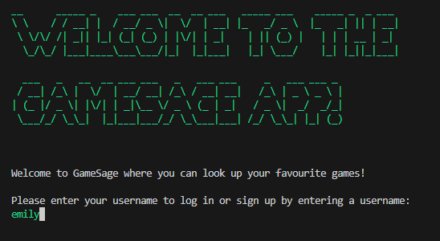

# GAMESAGE \- CLI Games Lookup App



Welcome to my first Python CLI App! <br>
Currently, two official plugins are available: <br>

This project uses Python, SQLAlchemy, and external libraries such as Tabulate, PyFiglet and Colorama.

## What's it About?

This CLI Games Lookup enables users to log in or sign up - view games, manage favourite games and notes associated with them.

## Getting Started

1. Clone the Repository:

```bash
git clone https://github.com/emilychewsh/phase-3-games-db-cli-project.git
cd phase-3-games-db-cli-project
```

2. Set up the virtual environment using Pipenv:

```bash
pipenv install
pipenv shell
```

3. Set up a virtual environment.

```bash
pipenv shell
```

4. Happy browsing!

## Credits:

- [Colorama](https://pypi.org/project/colorama/) for colours used.
- [Tabulate](https://pypi.org/project/tabulate/) for tables used.
- [PyFiglet](https://pypi.org/project/pyfiglet/) for tables used.

## License

This project is licensed under the MIT License.

## Contribution Guidelines

If you would like to contribute to the project development:

1. Fork the repository.
2. Create a new branch for your feature or bug fix.
3. Make your changes and submit a pull request.

Feel free to adjust any details or formatting to better suit your project and preferences!

## Contact

For any inquiries or feedback, please contact codewithemilychew@gmail.com.
